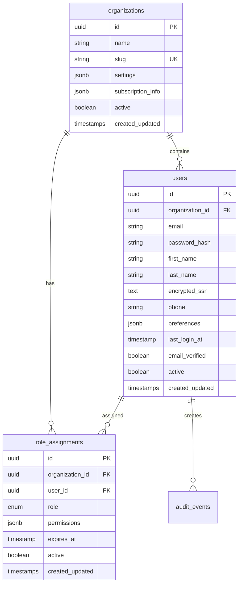
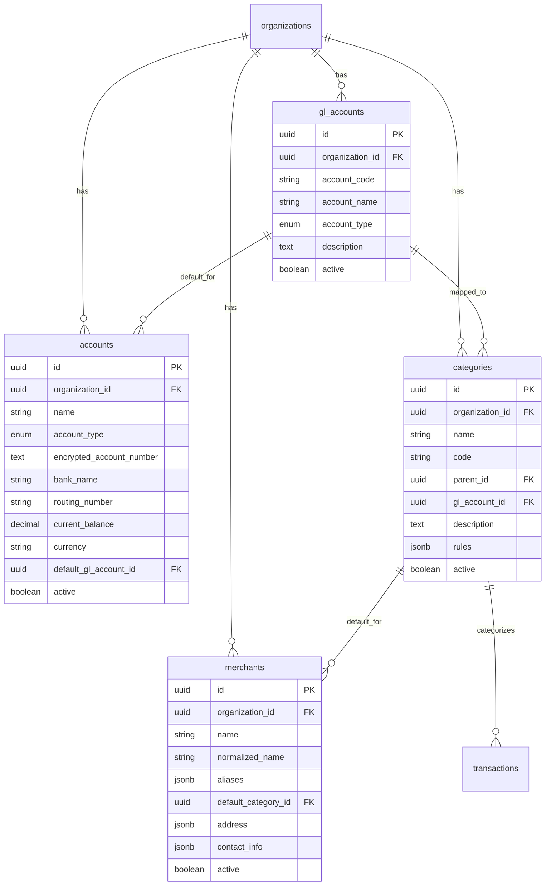
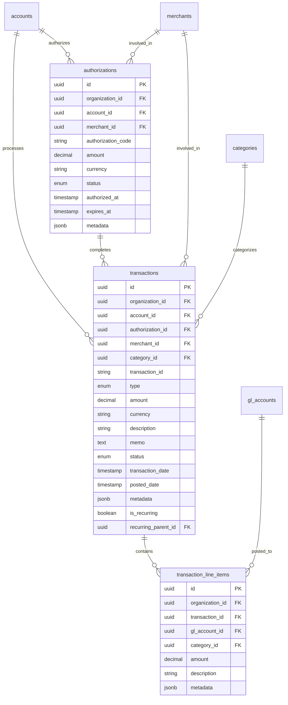
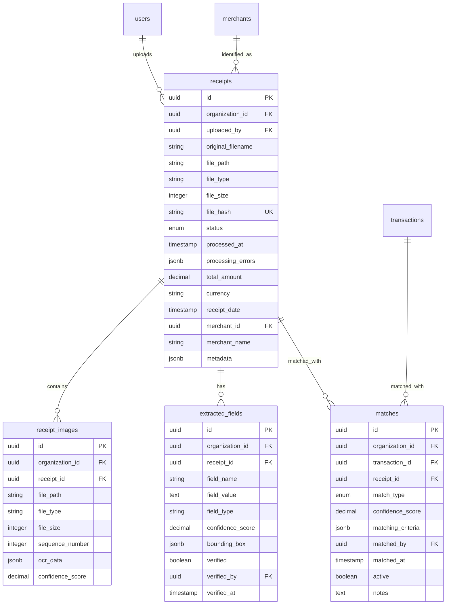

# Expense Platform Database Schema

## Overview

This document provides a comprehensive overview of the PostgreSQL database schema for the enterprise expense platform. The schema is designed with multi-tenant security, audit compliance, data encryption, and scalability in mind.

## Key Features

- **Multi-tenant Architecture**: Row-level security policies ensure complete data isolation between organizations
- **Enterprise Security**: Encrypted sensitive fields, UUID primary keys, comprehensive audit trails
- **Audit Compliance**: Immutable audit log with automatic triggers on all data changes
- **RBAC (Role-Based Access Control)**: Flexible permission system with fine-grained access controls
- **OCR Integration**: Receipt processing with extracted field storage and confidence scoring
- **Intelligent Matching**: Automated transaction-to-receipt matching with manual review capabilities

## Core Entities

### Organizations & Users



### Financial Structure



### Transactions & Authorization



### Receipt Processing & Matching



## Security Features

### Row-Level Security (RLS)

All tables implement row-level security policies that enforce organization-based isolation:

```sql
-- Example policy for multi-tenant isolation
CREATE POLICY users_isolation ON users
  FOR ALL USING (organization_id = current_setting('app.current_organization_id')::uuid);
```

To use RLS in your application, set the organization context:

```sql
SELECT set_config('app.current_organization_id', '<organization_uuid>', true);
```

### Data Encryption

Sensitive fields are encrypted using PostgreSQL's `pgcrypto` extension:

- `users.encrypted_ssn` - Social Security Numbers
- `accounts.encrypted_account_number` - Bank account numbers

Encryption functions are provided:

```sql
-- Encrypt sensitive data
SELECT encrypt_account_number('1234567890');

-- Decrypt sensitive data
SELECT decrypt_account_number(encrypted_account_number) FROM accounts;
```

### Audit Trail

All data changes are automatically logged to the `audit_events` table via triggers. The audit system captures:

- Event type (create, update, delete, login, logout, etc.)
- Complete before/after values
- User and organization context  
- Timestamp and metadata
- IP address and user agent (when available)

### Authentication & Authorization

The RBAC system supports:

- **Roles**: admin, manager, employee, viewer
- **Fine-grained permissions**: Per-resource CRUD permissions stored as JSON
- **Expirable assignments**: Role assignments can have expiration dates
- **Audit trail**: All permission changes are logged

## Data Types & Constraints

### Enums

- `user_role`: admin, manager, employee, viewer
- `transaction_type`: debit, credit
- `transaction_status`: pending, processed, rejected, cancelled
- `receipt_status`: uploaded, processing, processed, failed, matched
- `authorization_status`: pending, approved, rejected, expired
- `audit_event_type`: create, update, delete, login, logout, permission_grant, permission_revoke, data_export
- `match_status`: auto, manual, reviewed, rejected

### UUID Primary Keys

All tables use UUID primary keys for:
- Security (harder to guess than sequential integers)
- Distributed systems compatibility
- No information leakage about record counts

### Indexes

Strategic indexes are placed on:
- Foreign keys for join performance
- Query-heavy fields (status, dates, active flags)
- Multi-column indexes for common query patterns
- Composite indexes for organization + date range queries

## Usage Examples

### Setting Up Organization Context

```sql
-- Set organization context for RLS
SELECT set_config('app.current_organization_id', '00000000-0000-0000-0000-000000000001', true);
SELECT set_config('app.encryption_key', 'your-encryption-key-here', true);
```

### Common Queries

```sql
-- Get user's role and permissions
SELECT r.role, r.permissions, r.expires_at
FROM role_assignments r
WHERE r.user_id = $1 AND r.active = true;

-- Find unmatched transactions
SELECT t.*
FROM transactions t
LEFT JOIN matches m ON t.id = m.transaction_id AND m.active = true
WHERE m.id IS NULL
  AND t.status = 'processed'
  AND t.organization_id = current_setting('app.current_organization_id')::uuid;

-- Get receipt processing status
SELECT 
  r.id,
  r.status,
  r.original_filename,
  COUNT(ef.id) as extracted_fields_count,
  AVG(ef.confidence_score) as avg_confidence
FROM receipts r
LEFT JOIN extracted_fields ef ON r.id = ef.receipt_id
WHERE r.organization_id = current_setting('app.current_organization_id')::uuid
GROUP BY r.id, r.status, r.original_filename;
```

### Encryption Usage

```sql
-- Insert account with encrypted account number
INSERT INTO accounts (id, organization_id, name, account_type, encrypted_account_number, ...)
VALUES (
  uuid_generate_v4(),
  current_setting('app.current_organization_id')::uuid,
  'Business Checking',
  'checking',
  encrypt_account_number('1234567890'),
  ...
);

-- Query with decrypted account numbers (requires encryption key in session)
SELECT 
  id,
  name,
  account_type,
  decrypt_account_number(encrypted_account_number) as account_number
FROM accounts
WHERE organization_id = current_setting('app.current_organization_id')::uuid;
```

## Performance Considerations

1. **Partitioning**: Consider partitioning large tables like `transactions` and `audit_events` by date
2. **Archiving**: Implement data archiving strategy for old audit events and transactions
3. **Connection Pooling**: Use connection pooling to manage database connections efficiently
4. **Monitoring**: Set up monitoring for slow queries and index usage

## Backup & Recovery

- **Full backups**: Daily full database backups
- **Point-in-time recovery**: Enable WAL archiving for point-in-time recovery
- **Encryption**: Backup files should be encrypted at rest
- **Testing**: Regular backup restoration testing

## Migration Strategy

1. Use Knex.js migrations for version control
2. Test all migrations on staging environment first
3. Include rollback procedures for each migration
4. Plan for zero-downtime deployments when possible
5. Monitor performance impact of schema changes

## Compliance Features

- **SOX Compliance**: Immutable audit trail with complete data lineage
- **PCI DSS**: Encrypted storage of sensitive payment data
- **GDPR**: User data anonymization and deletion capabilities
- **SOC 2**: Comprehensive access controls and audit logging